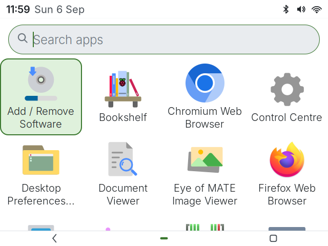
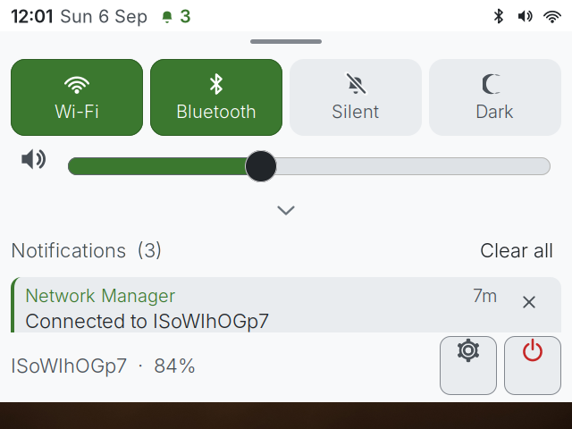
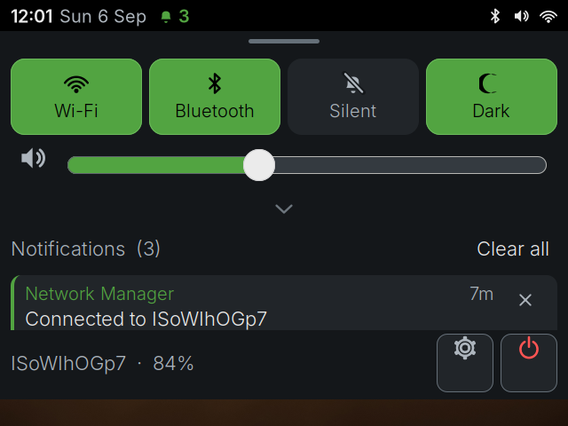

# TrailShell

A touch-first X11 desktop shell for the **PocketTerm35** — a Raspberry Pi 5
behind a 3.5" 640x480 touchscreen with a built-in QWERTY keyboard.

It is not a theme on top of a normal desktop. It is a small shell (status bar,
swipe-down shade, launcher, task switcher, notification server) built for one
specific screen, with window policy to match.



## Why it looks the way it does

Three facts about the hardware drove almost every decision:

**The panel is ~228 PPI on only 640x480 pixels.** That is phone-class density
on a fraction of a phone's pixel budget. Text sized for a 96 DPI desktop is
physically microscopic; text sized for legibility eats the screen. So the
design is specified in *millimetres* and converted (`trailshell/theme.py`):
body text is 24 px ≈ 2.7 mm em, matching what a 400 PPI phone renders for 16sp,
with a hard floor of 20 px. Touch targets are 64 px ≈ 7.1 mm, in line with
Android's 48dp and iOS's 44pt. Nothing is sized in points, because Xft DPI
settings would then silently undo the whole exercise.

**There is a real keyboard and no on-screen keyboard.** This inverts the usual
phone-shell assumption. The keyboard is the *primary* input, so the launcher's
search field is focused the moment it opens — start typing and you are already
filtering, with no tap to "enter search mode". Every touch affordance has a key
equivalent, defined once in `trailshell/keymap.py` and read by both the hotkey
grabber and the on-screen cheat sheet so the help can never drift.

**Apps are full-screen, chromeless and immovable.** At 640x480 there is no
useful overlap between windows, and a title bar plus borders would spend ~10%
of the screen enabling something nobody wants here. Openbox is configured for
undecorated maximised windows, but that alone is not enough: openbox has no
"may not be moved" rule, and clients with their own decorations (Chromium, any
GTK header-bar app) map at a remembered windowed size and ignore the WM. So the
shell enforces the policy itself over EWMH (`trailshell/wm.py`), which also
means it holds when you run `trailshell` on top of an existing desktop.

It respects `WM_NORMAL_HINTS` rather than overriding them. A terminal resizes
in whole character cells — lxterminal reports base 15x34 with increments of
8x17, so the largest it can be inside the 640x414 canvas is 639x408. Demanding
640x414 anyway gets 639x408 back, and treating that as failure causes an
endless resize war; snapping the target to the client's increments avoids the
fight instead of papering over it.

**Some apps refuse to fit, so they can be panned.** A few applications declare
a minimum size larger than the entire canvas — GIMP's main window clamps at
640x503 however it is asked, and its "Welcome to GIMP" dialog is 653x684, which
is bigger than the whole screen. Their bottom edge, where the buttons live,
lands off screen. On a normal desktop you would drag the window up; TrailShell
forbids dragging, so it owes you a replacement.

When a window exhausts its placement budget without shrinking, the shell stops
fighting it and switches to panning: a slim control appears against the right
edge (and `Super+Up` / `Super+Down` do the same) to scroll the window within
the screen. Panning moves the window manager's *frame* directly rather than
going through `_NET_MOVERESIZE_WINDOW`, because GIMP re-centres its dialog the
moment the WM moves it — the polite request is silently undone.

**It is a true multitouch panel driven by libinput.** GTK therefore receives
real touch events, which is why the shade and launcher are GTK widgets rather
than Cairo drawings — a list you can flick is worth more here than a list drawn
slightly more sharply.

GTK's built-in `kinetic-scrolling` turned out not to be enough on its own: it
reacts only to real touch sequences, ignores mouse and trackpad drags entirely,
and any child widget that handles button events can swallow the sequence. In
practice the only thing that reliably scrolled was the scrollbar, which is an
unusable target on a 3.5" screen. `ui.attach_drag_scroll()` replaces it with
explicit drag-to-scroll plus inertia, claiming the gesture only once movement
is decisively vertical so horizontal swipe-to-dismiss still wins. The scrollbar
is now only an indicator.

Patterns are borrowed from Android and iOS where they earn their keep (a
swipe-down shade, tiered quick settings, swipe-to-dismiss, a bottom nav bar),
and dropped where they do not: there is no on-screen keyboard, no horizontal
recents carousel — at this size a vertical list shows five apps instead of one —
and no workspaces.

## What's in it

| Surface | What it does |
|---|---|
| **Status bar** (36 px) | Clock, date, notification count, Wi-Fi / volume / Bluetooth / battery. Doubles as the shade's grab handle. |
| **Shade** | Swipe down from the status bar. Quick settings, volume, and notifications. Tracks your finger 1:1 and settles on release velocity. |
| **Launcher** | The home screen. Frecency-ordered app grid, and a keyboard search that is always live. |
| **Recents** | Open windows as swipeable cards. Swipe sideways to close. |
| **Nav bar** (34 px) | Back / Home / Recents, flush to the bottom edge, with legends for the dedicated START and SELECT keys. |
| **Notifications** | A real `org.freedesktop.Notifications` server, so `notify-send` and any libnotify app just work. Heads-up banner, then history in the shade. |
| **Shortcuts sheet** | The keyboard manual, since there is no OSK to discover things with. |
| **Power sheet** | Restart / Shut down / Log out, via logind. Restart is first because the top row is where a thumb lands. |

### The shade

Swipe down from the status bar — or `Super+n`, or tap the bar.



Quick settings are **tiered**: the four toggles you actually reach for plus the
volume slider are always visible, and the chevron reveals the rest. That is not
a cosmetic choice — on a 414 px canvas, a permanent second row of tiles is the
difference between seeing your notifications and not.

The sheet reveals itself with an X shape region rather than by resizing or
moving the window: no compositor runs in this session, so alpha blending is not
available, and reshaping is far cheaper per frame.

## Light and dark

Light is the default — this panel is mostly read in daylight. Dark is a
first-class alternative for night use, one tap away in the shade or `Super+d`.

| Light | Dark |
|---|---|
|  |  |

Colours come from [trailcurrent.com](https://trailcurrent.com)'s palette. The
brand accents (`#52a441`, `#48e6fe`, `#74fe00`, `#ff5453`) were designed to sit
on dark and photographic grounds and land at 1.4:1–3.1:1 on white, so the light
palette uses darkened variants for anything inked onto the background. Both
palettes are checked, not eyeballed:

```sh
python3 tools/contrast.py     # WCAG audit of every ink/ground pair, exits 1 on failure
```

## Install

```sh
./install-deps.sh        # runtime packages (see packages.runtime)
./install.sh             # installs the shell and registers the session
```

Then switch to it:

```sh
sudo ./tools/set-session.sh trailshell     # and reboot, or restart lightdm
sudo ./tools/set-session.sh rpd-x          # back to the Pi desktop, any time
```

Use the script rather than logging out and picking from a menu: Raspberry Pi
OS ships **pi-greeter, which has no session picker**, and LightDM chooses a
session from four places that outrank each other — `autologin-session`, the
user's `~/.dmrc`, the AccountsService `XSession=` cache, and finally
`user-session`. Setting just one of them silently does nothing.
`tools/set-session.sh` sets all four and `--show` prints the current state.

The installer is otherwise non-destructive: it adds a session alongside the
stock Raspberry Pi desktop, and `./uninstall.sh` reverses everything. If
TrailShell ever fails to start, the session script hands the display back to
the Pi desktop rather than leaving a black screen on a device that autologins,
and logs the reason to `~/.local/share/trailshell/session.log`.

To try it over your current desktop without logging out:

```sh
trailshell          # or: python3 -m trailshell
```

## Keyboard

| | |
|---|---|
| `Super+h` | Home |
| `Super+a` | All apps / search |
| `Super+Tab` | Recent apps |
| `Alt+Left` | Back |
| `Super+n` | Notifications & quick settings |
| `Super+q` | Close current app |
| `Super+↑` / `Super+↓` | Scroll a window that is taller than the screen |
| `Super+d` | Light / dark |
| `Super+p` | Screenshot |
| `Super+/` | Show all shortcuts |

The dedicated **START** and **SELECT** keys map to Home and Recents. The nav bar
draws their legends next to the icon each one triggers — but only if that key
actually grabbed, so it can never advertise a key that does nothing.

### The physical buttons

The keyboard has a D-pad, six face/shoulder buttons, and dedicated START and
SELECT. As shipped, only START and SELECT were usable: the six buttons sent the
plain letters `a b x y l r`, indistinguishable from typing.

Its firmware — CircuitPython, so the keymap is a Python file — has been read,
backed up and modified so the six buttons send **F13–F18** instead. That costs
nothing: every one of those letters already exists on the main QWERTY rows, so
the gamepad cluster was a set of duplicates. The D-pad is deliberately
unchanged, because it is the only source of arrow keys on the board.

| Button | Sends | In the shell |
|---|---|---|
| A | `F18` | Select / launch |
| B | `F17` | Back / close |
| X | `F15` | Close item |
| Y | `F16` | Notifications |
| L / R | `F13` / `F14` | Page up / down |
| START | `Pause` | Home |
| SELECT | `Print` | Recent apps |

`F13`–`F18` are **not grabbed globally** — the point of moving them off letters
was to give applications six real, unused keys, so the shell only acts on them
while one of its own surfaces has focus.

Two things had to be verified rather than assumed, and are written up in
[`docs/keyboard-firmware.md`](docs/keyboard-firmware.md): that the HID report
descriptor permits usages above F12 (it allows the full 0–255 range), and that
X actually calls them F13–F18 — **it does not.** The stock xkb map labels those
keycodes `XF86Tools` and `XF86Launch5`..`XF86Launch9`, so binding "F13" would
have silently never fired. The session renames them.

`Fn +` / `Fn -` (backlight) and `Fn e` / `Fn r` (volume) are PWM outputs of the
keyboard's microcontroller and **never reach Linux**, so there is nothing to
bind. Note this means the shade's volume slider and `Fn e`/`Fn r` control two
different, independent volumes.

Each shortcut also has a `Ctrl+Alt` alias, used automatically if another client
already owns the Super combination.

The keyboard's firmware has been read, backed up and documented — see
[`docs/keyboard-firmware.md`](docs/keyboard-firmware.md) for the full key
matrix and which keycodes (`F13`-`F24`) are free for customisation.

## Development

```sh
./install-deps.sh --dev            # adds Xvfb, xdotool, notify-send

python3 tools/contrast.py          # palette accessibility audit
python3 tools/iconsheet.py         # render every glyph at real sizes
./tools/test-session.sh            # full session on an isolated 640x480 Xvfb
./tools/drive.sh                   # drive the shell over the live :0 session
python3 tools/shot.py out.png      # screenshot the running display
```

`tools/test-session.sh` is the honest test: it starts openbox with this
project's own config on a private display, so nothing is inherited from the
host's LXDE session.

### Layout

```
trailshell/
  theme.py        design tokens - the only place a colour or size is decided
  style.py        GTK stylesheet, generated from theme.py
  icons.py        Cairo vector glyphs (theme icons are mush at 20 px)
  keymap.py       every shortcut, once
  x11.py          EWMH: struts, window list, hotkey grabs
  providers.py    clock, network, audio, dim, bluetooth, power
  apps.py         .desktop catalogue, icons, frecency, search
  bar.py nav.py   the two Cairo-drawn chrome strips
  wm.py           window policy: full-screen, chromeless, immovable
  panner.py       pan control for windows that refuse to fit
  shade.py        quick settings + notifications
  launcher.py     home screen
  switcher.py     recents
  notifications.py  org.freedesktop.Notifications server
  banner.py       heads-up notifications
  shortcuts.py    the keyboard cheat sheet
  shell.py        wiring and window policy
session/
  openbox-rc.xml       window policy: undecorated, maximised, one desktop
  trailshell-session   session entry point
```

`theme.py` really is the single source of truth: `style.py` generates the CSS
from it, and the palette is mutated in place on a theme change so every module
that did `C = theme.C` at import tracks the switch with no re-resolution.

## Documentation

- [`docs/hardware.md`](docs/hardware.md) — measured panel, touch, keyboard and
  power characteristics, and what each one forced in the design
- [`docs/keyboard-firmware.md`](docs/keyboard-firmware.md) — the keyboard's
  CircuitPython firmware: complete key matrix, what the PWM pins drive, how to
  back it up and restore it, and which keycodes are free
- [`docs/image-build.md`](docs/image-build.md) — reproducing this on a
  Raspberry Pi image

## Requirements

X11. The shell uses EWMH struts, `_NET_CLIENT_LIST_STACKING` and `XGrabKey`,
and — more importantly — the panel and touchscreen are known-good under X on
this hardware. Do not switch the session to Wayland/labwc.
