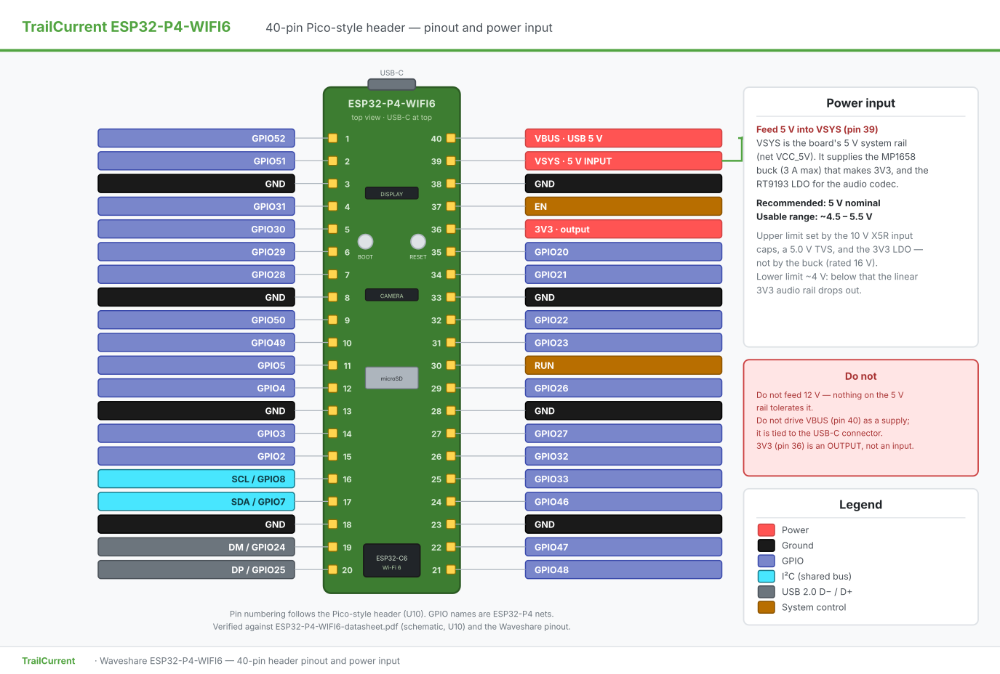

# ESP32-P4-WIFI6 Demo — Wi-Fi provisioning, web UI & microSD

ESP-IDF project for the [Waveshare ESP32-P4-WIFI6](https://www.waveshare.com/esp32-p4-wifi6.htm?sku=31647)
development board, configured for the **bare board** — no MIPI-DSI display and
no MIPI-CSI camera fitted.

The board picks one of two modes at boot, based on whether Wi-Fi credentials
are stored in NVS:

| | **Setup mode** — no saved credentials | **Normal mode** — credentials found |
|---|---|---|
| Radio | Hosts its own Wi-Fi network | Joins your network |
| Web UI | Scan, pick a network, enter password | Board details, microSD capacity, file management |
| Ends with | Verifies, saves, reboots | Runs until you forget the network |

Both UIs are TrailCurrent-branded, sharing the design tokens and component
shapes of the Overlook PWA.

---

## Quick start

1. Flash and open the monitor. With no saved network the console prints:

   ```
   SETUP MODE — no Wi-Fi network saved yet
    1. Join the Wi-Fi network:  TrailCurrent-Setup-A1B2
    2. Password              :  trailcurrent
    3. Open                  :  http://192.168.4.1/
   ```

2. Join that network from a phone or laptop. A captive-portal prompt should
   open the page on its own; if not, browse to `http://192.168.4.1/`.
3. Pick your network, enter the password, press **Join network**. The board
   tests the connection *before* saving it, so a wrong password reports an
   error instead of bricking the next boot.
4. On success it saves the credentials and reboots. The console then prints the
   dashboard address on your own network:

   ```
   Dashboard ready:  http://192.168.1.57/
   Network        :  YourNetwork (-48 dBm)
   ```

> **Terminology.** You asked for "station mode" for provisioning. What is
> implemented is **SoftAP** (access point) — the board *hosts* a network that
> your phone joins. In 802.11 terms your phone is the station and the board is
> the AP; a board in station mode could not be connected to directly. Setup
> actually runs in **APSTA**, because the station interface is needed to scan
> and to test a candidate network without dropping the client driving the UI.

---

## Board configuration

| Item | Value | Where it's set |
|---|---|---|
| Target | `esp32p4` | `sdkconfig.defaults` |
| Flash | **32 MB** NOR, QIO, 80 MHz | `CONFIG_ESPTOOLPY_FLASHSIZE_32MB` |
| PSRAM | **32 MB** in-package HEX, 200 MHz, XIP | `CONFIG_SPIRAM_MODE_HEX`, `CONFIG_SPIRAM_SPEED_200M` |
| L2 cache | 256 KB, 128-byte lines | `CONFIG_CACHE_L2_CACHE_256KB` |
| Chip revision | pre-v3.0 (this board is **v1.3**) | `CONFIG_ESP32P4_SELECTS_REV_LESS_V3` |
| Console | UART0 via onboard USB-UART bridge | `CONFIG_ESP_CONSOLE_UART_DEFAULT` |

Because the flash is larger than 16 MB, ESP-IDF automatically enables 32-bit
flash addressing (`CONFIG_BOOTLOADER_FLASH_32BIT_ADDR`). Nothing extra is needed.

The PSRAM size is **auto-detected** by the driver — ESP32-P4 has no size Kconfig.
Confirm it in the boot log:

```
I (xxx) esp_psram: Found 32MB PSRAM device
I (xxx) esp_psram: Speed: 200MHz
```

`app_main` re-checks both at runtime and logs a warning if either does not match
32 MB, so a silent misconfiguration cannot slip past.

> **Note on chip revision.** ESP32-P4 rev <3.0 and rev >=3.0 are mutually
> exclusive build targets — esptool refuses to flash a binary built for the
> wrong range:
>
> ```
> A fatal error occurred: bootloader/bootloader.bin requires chip revision
> in range [v3.0 - v3.99] (this chip is revision v1.3).
> ```
>
> **This board carries rev v1.3 silicon**, so the pre-v3.0 profile is selected.
> The resulting bootloader accepts v0.1 – v1.99. If you move the project to a
> board with v3.0+ production silicon, swap the two lines under "Chip revision"
> in `sdkconfig.defaults` as noted in the comment there, then
> `rm sdkconfig && idf.py build`. Check any board with
> `esptool.py --port <PORT> chip_id`.

### Partition table

`partitions.csv`, sized for the 32 MB flash:

| Name | Type | Offset | Size |
|---|---|---|---|
| `nvs` | data/nvs | 0x9000 | 24 KB |
| `phy_init` | data/phy | 0xf000 | 4 KB |
| `factory` | app | 0x10000 | 8 MB |
| `storage` | data/fat | 0x810000 | 16 MB |

~8 MB is left unallocated for OTA or future use.

---

## Wi-Fi: the ESP32-P4 has no radio

This matters more than anything else here. **The ESP32-P4 has no Wi-Fi of its
own.** The board carries an ESP32-C6 companion connected over SDIO, and two
managed components bridge to it:

- `espressif/esp_wifi_remote` — presents the ordinary `esp_wifi` API and
  forwards each call to the companion.
- `espressif/esp_hosted` — the SDIO transport underneath.

Both are pulled in by [main/idf_component.yml](main/idf_component.yml); nothing
needs to be vendored. Because `esp_wifi_remote` mimics the normal API, the code
in [wifi_manager.c](main/wifi_manager.c) looks like any other ESP32 Wi-Fi code.

The SDIO pin map needs no overrides — `esp_hosted`'s own ESP32-P4 defaults
match this board:

| Signal | GPIO |
|---|---|
| CLK | 18 |
| CMD | 19 |
| D0–D3 | 14 / 15 / 16 / 17 |
| Reset | 54 |

**The C6 must be running ESP-Hosted slave firmware.** Boards ship pre-flashed
with it, so this normally just works. If `esp_wifi_init` fails at boot, that is
the cause, and the firmware says so explicitly rather than reporting a generic
Wi-Fi error:

```
E (…) wifi_mgr: esp_wifi_init failed: ESP_ERR_INVALID_STATE
E (…) wifi_mgr: The ESP32-P4 has no radio of its own — check that the
                onboard ESP32-C6 is running ESP-Hosted slave firmware
```

Updating the slave firmware is documented in the component itself, under
`managed_components/espressif__esp_hosted/docs/`. It can be done over the air
from the host, or with an ESP-Prog wired to the C6.

---

## Web UI

### Setup mode

Served when NVS holds no credentials.

- SoftAP `TrailCurrent-Setup-XXXX` (last two MAC bytes appended, so two boards
  on a bench do not clash), WPA2, default password `trailcurrent`.
- A captive-portal DNS responder ([dns_portal.c](main/dns_portal.c)) answers
  every A query with the board's address, and the usual per-platform probe URLs
  (`/generate_204`, `/hotspot-detect.html`, `/ncsi.txt`, …) redirect to `/`.
  Together those are what make the page pop up automatically.
- Networks are listed strongest-first with duplicate SSIDs collapsed — a mesh
  or a dual-band router otherwise appears several times.
- **Credentials are only saved after the connection is proven.** The board
  associates first and persists to NVS only on success.

### Normal mode

Served once credentials exist. The board joins the saved network and presents
four pages behind a bottom navigation bar (the selected page survives a reload
via the URL hash):

- **Home** — intentionally empty for now; a landing spot for future content.
- **AI** — live object detection from a camera on the MIPI-CSI connector
  (OV5647). Start/stop button, MJPEG live view with detection boxes drawn on an
  overlay canvas, per-class confidence list, fps and inference-time readouts.
  See "AI camera" below.
- **Audio** — the Record/Stop button, live elapsed timer, and the result of the
  last recording with its level meter and inline playback. Reloading while a
  recording runs lands here, with the Stop button restored.
- **Files** — the microSD browser (loads lazily, when first opened).
- **Settings** — three cards: **Wi-Fi** (SSID, IP, MAC, RSSI, channel, and the
  **Forget network** button that erases NVS and reboots into setup),
  **microSD** (card name, type, capacity, bus, used/free meter), and **About**
  (chip, cores, silicon revision, flash, PSRAM, internal RAM, IDF version,
  firmware build date, uptime).

On the Files page, each `.wav` row offers two independent playback paths:

  | Button | Where the audio comes out |
  |---|---|
  | **▶ Web** | Your browser. The file is streamed over HTTP and played by an inline `<audio>` element — tests the card, the filesystem and the network path. |
  | **🔈 Board** | A speaker wired to the board's MX1.25 2P header, via the ES8311 DAC. Tests the codec's output path and the amplifier. The button becomes **■ Stop** while playing. |

  Only `.wav` rows get these; offering playback on a text file would just be a
  button that fails. Every file row also has a **⬇ Download** button — a plain
  anchor to the streaming endpoint with `dl=1`, so the browser saves the file
  under its own name and a large file streams to disk without ever having to
  fit in page memory.

### Microphone

The dashboard has a **Microphone** card. Press **Record**, and the same button
becomes **Stop** with a running timer beside it; press it again to finish. The
result appears inline with a playback control, so the whole path — mic → codec
→ I2S → SD → HTTP → browser — is testable, and you can cycle straight into the
next recording.

Capture runs on its own task, so the HTTP server stays responsive throughout —
the browser polls elapsed time twice a second while it runs. **Recording runs
until you press Stop.** There is no time limit by default: audio streams to the
card through a 16 MB PSRAM ring buffer, so length is bounded by card space
(32 KB/s — about 250 hours on the 29 GB card), not by RAM. It ends on its own
only if the card fills or the WAV format's 32-bit size ceiling approaches
(~30 h); an optional cut-off can be set via `CONFIG_DEMO_AUDIO_MAX_SECONDS`
(0 = disabled, the default). Whenever the board stops itself, the UI notices
and settles back to **Record**.

The onboard SMD microphone is **analog**, feeding an ES8311 codec; the P4 reads
the digitised audio over I2S. It is not a PDM mic, so the codec is configured
with `es8311_microphone_config(dev, false)` — setting that `true` configures a
PDM input and yields silence.

| Signal | GPIO |
|---|---|
| I2C SDA / SCL (codec control) | 7 / 8 |
| I2S MCLK | 13 |
| I2S BCLK | 12 |
| I2S WS | 10 |
| I2S DIN (from codec ADC) | 11 |
| I2S DOUT (to codec DAC) | 9 |
| Speaker amplifier enable | 53 |

MCLK is supplied on its own pin at **384×** the sample rate; the codec cannot
derive its clock from SCLK in this wiring. The speaker amplifier is held off
during capture so it cannot feed back into the microphone.

**Recordings report their signal level, and that is the point.** A dead or
misconfigured microphone produces a flat stream of near-zero samples — which is
byte-for-byte indistinguishable from a perfectly good recording of a quiet room
if you only check that a file was created. So each capture returns peak and RMS
in dBFS, and anything whose peak never clears
`CONFIG_DEMO_AUDIO_SILENCE_THRESHOLD` is flagged:

> Recording saved, but no sound was detected. The microphone may not be working
> — try speaking closer, or raise the mic gain in menuconfig.

Files land in `/sdcard/recordings/rec-NNNN.wav`, numbered upwards so captures
accumulate rather than overwriting. Format is 16-bit mono PCM at 16 kHz —
32 KB per second.

### Speaker playback

Recording and playback share one I2S port, one clock and one codec, so only one
runs at a time — trying to play during a recording returns a clear "busy" error
rather than corrupting both. The speaker amplifier (GPIO 53) is switched on
only for the duration of playback and muted *before* the clocks stop, so the
speaker gets no shutdown click; the rest of the time it stays off so it cannot
feed back into the microphone.

Playback accepts any uncompressed 16-bit PCM WAV, mono or stereo. Mono files
are duplicated into both I2S slots (the link always carries two), and files at
a different sample rate retune the I2S clock and codec for the duration, then
restore the recording rate. The RIFF parser walks the chunk list rather than
assuming a 44-byte header, so PC-authored files with LIST/fact metadata chunks
play from the right offset instead of playing their metadata as noise.

Speaker volume is `CONFIG_DEMO_AUDIO_SPEAKER_VOLUME` (default 80 of 100).

### Push-to-talk — asking Peregrine a question

A push button fitted between **header pin 35 (GPIO20)** and any ground pin
turns the board into a voice terminal for
[Peregrine](../../Product/TrailCurrentPeregrine), the local AI voice assistant.
Hold the button, ask a question, let go. The board uploads what it heard and
plays the spoken answer through the speaker.

```
hold      -> capture into PSRAM (no card writes while the mic is live)
release   -> POST /api/voice   ->  speech recognition -> LLM -> speech synthesis
             reply streams back -> speaker, played as it arrives
```

The reply starts playing before the server has finished generating it: the
response body is fed to the speaker chunk by chunk, and the speaker paces the
download rather than the whole answer being buffered first.

**Configuration lives on the SD card**, not in the firmware, so one image can
serve boards pointed at different servers and a token can be rotated without a
rebuild. Create `/sdcard/environment.conf`:

```ini
# Peregrine voice assistant
PEREGRINE_URL=http://peregrine.local:8081
PEREGRINE_VOICE_TOKEN=<the token from ~/.peregrine-voice-token>
```

The token is the one installed on the Peregrine box as `PEREGRINE_VOICE_TOKEN`
— see [voice-terminal.md](../../Product/TrailCurrentPeregrine/docs/voice-terminal.md)
for generating it. Without **both** keys the button is inert and says so on the
console rather than failing on every press; a rejected token is reported as
`HTTP 401 — the bearer token was rejected`, since a mismatch between card and
server is the usual setup mistake.

The board must already be on your Wi-Fi network, which is the normal setup flow
above — Peregrine is reached over the LAN by plain HTTP.

**Replies play quieter than files, deliberately.** Speech synthesis normalises
its output to full scale — a measured reply peaked at exactly 32767, 0 dBFS —
while a microphone recording of a room peaks far lower. The ES8311's volume
control is not an attenuator: it maps to the DAC volume register in 0.5 dB
steps where **75 is unity gain**, so anything above that applies *positive*
gain and clips already-full-scale audio before it reaches the amplifier. The
file-playback default of 80 is +6.5 dB and audibly distorts a spoken reply, so
replies use their own `CONFIG_DEMO_AUDIO_ASSISTANT_VOLUME` (default 70, about
6 dB of headroom). If replies sound harsh rather than quiet, lower this rather
than reaching for the amplifier.

Notes on the behaviour:

- **A press during a reply is ignored**, with a log line. The codec cannot
  capture and play at once, and cutting the answer off mid-sentence to listen
  again proved more confusing than waiting.
- **Captures are held in memory and discarded**, never written to the card. A
  query is a few seconds long, and skipping the card avoids the SD write bursts
  that couple into the microphone's analog path (see "Birdies" below).
- **A stuck button cannot exhaust PSRAM**: capture stops at
  `CONFIG_DEMO_PTT_MAX_SECONDS` (default 30) and sends what it has.
- The reply's sample rate is read from **its own WAV header**, not assumed.
  Peregrine resamples to whatever its target rate is, and playing a 22.05 kHz
  reply at 16 kHz pitches the voice down about four semitones.

The console narrates each exchange, including what Peregrine transcribed and
what it answered:

```
I (18420) peregrine: Listening…
I (21050) peregrine: Sending 2.44 s to http://peregrine.local:8081/api/voice
I (23110) peregrine: Heard: what time is it
I (23110) peregrine: Replied: It's twenty past four.
I (23180) audio: Streaming reply at 16000 Hz
I (26640) peregrine: Reply finished (112684 bytes)
I (26640) peregrine: Exchange took 5590 ms (upload 640 ms)
```

### "Birdies": the cross-core ring race, and Wi-Fi

Early streaming builds put faint bird-like swept chirps (3.6–8 kHz, ~100 ms,
never twice the same shape) into recordings. Two mechanisms, which interact:

1. **A cross-core data race in the capture ring.** The capture task and the
   writer task run on different RISC-V cores, and the first ring implementation
   published `head` with a plain store while the writer spun with `tail`
   hugging `head`, reading samples microseconds after they were written. Under
   RISC-V weak memory ordering the sample stores and the `head` update can
   become visible out of order, so the writer could read stale PSRAM at the
   head and put corrupted samples in the file. The fix is threefold: `head` and
   `tail` are published with release/acquire atomics; the writer stays 256 ms
   behind the live head while capture runs; and it writes in ≥32 KB batches
   with 200 ms sleeps instead of spinning. Bus contention (e.g. Wi-Fi SDIO DMA)
   widens such race windows, which is how this defect masqueraded as pure radio
   noise in an A/B test.
2. **Radio bursts from the ESP32-C6** correlate strongly with chirps (measured:
   10 chirps in an 18 s window of flooded HTTP traffic vs 1 in a radio-quiet
   window). Whatever fraction of that is genuine analog coupling is board-level
   and can only be minimised: the dashboard keeps its own elapsed clock while
   recording and asks the board for state only every 10 s. For the cleanest
   capture, avoid file browsing or downloads while recording.
3. **SD write current bursts** couple into the mic path the same way — after
   the race fix, the residual artifacts rode exactly on the writer's ~1 s
   batch cadence. The ring is therefore sized at 16 MB (8.5 minutes of audio)
   and the card is written only when the ring is half full or the recording
   stops. Recordings under ~8.5 minutes have **zero SD activity while the
   microphone is live** — the same property that made the original
   fixed-length firmware clean — and longer ones get one write burst every
   ~4 minutes instead of one per second. The cost: pressing Stop can take a
   few seconds while the buffered audio flushes to the card.

**The capture loop never touches the SD card.** The capture task fills a 16 MB
PSRAM ring buffer; a lower-priority writer task drains it to the file. Writing
inside the capture loop was what made words run together in early builds: at
the start of a file FAT does its heaviest work — directory entry, first cluster
allocation, FAT table update — and with 32 KB clusters that can stall past
100 ms, which is longer than the I2S DMA ring holds. The ring overflowed, the
driver silently dropped audio, and the surviving pieces spliced together,
deleting the gaps between words. On a real recording, 12 of 14 waveform
discontinuities landed in the first second. With the ring in between, the card
can stall for minutes before any audio is lost (and if it somehow does,
the shortfall is counted and logged rather than silently spliced). DMA headroom
is also raised from the default 90 ms to ~256 ms as first-line insurance.

---

## Power input



This board uses a **Raspberry Pi Pico–style header**, not a Raspberry Pi HAT
header — which is why VBUS/VSYS appear at all, and why HAT documentation does
not describe them. From the schematic, header U10:

| Pin | Name | Net | What it is |
|---|---|---|---|
| 40 | VBUS | `USB0_5V` | 5 V straight off the USB Type-C connector |
| **39** | **VSYS** | `VCC_5V` | **The power input** — the board's 5 V system rail |
| 37 | 3V3_EN | — | Regulator enable |
| 36 | 3V3_OUT | `ESP_3V3` | 3.3 V *output*, not an input |
| 30 | RUN | `ESP_EN` | Reset |

**Feed 5 V into VSYS (pin 39).** `VCC_5V` is the rail everything hangs off: it
feeds U1, an **MP1658GTF-Z** buck marked **3A MAX** on the schematic (4.7 µH
2.8 A inductor) producing `ESP_3V3`, and U8, an **RT9193-33PB** LDO producing
the analog 3.3 V for the audio codec. A P-channel MOSFET (**AO3401**) sits
between `USB0_5V` and `VCC_5V` as a power path, so USB and an external supply
on VSYS coexist without back-feeding the USB port.

> **Waveshare publishes no stated VSYS voltage range** — the "datasheet" is a
> schematic with no ratings table. The figures below are what the fitted parts
> constrain it to, not a manufacturer specification. Treat them as such.

**Use 5 V nominal. Stay within roughly 4.5–5.5 V.**

- **Upper bound.** The `VCC_5V` input capacitors (C11 10 µF, C12 100 nF) are
  **X5R 10 V** parts, and an **LTVS16H5.0ET5G** TVS with a 5.0 V standoff sits
  on the USB 5 V net. The RT9193 LDO hanging directly off `VCC_5V` is a ~5.5 V
  operating / ~6 V absolute part. The MP1658 buck itself is rated to 16 V, but
  it is **not** the limiting component — do not read the buck's rating as the
  board's.
- **Lower bound.** The RT9193 is a linear regulator producing 3.3 V, so it
  needs roughly 3.6 V in before the analog audio rail drops out. This is *not*
  a wide-input buck-boost like a real Pico's 1.8–5.5 V VSYS.

Do not feed 12 V here, and do not drive VBUS (pin 40) as a supply input — it is
tied to the USB connector.

If you need certainty beyond component ratings, measure `VCC_5V` with USB
attached and check the MP1658 and RT9193 datasheets against your intended
supply.

### AI camera

The AI page runs this pipeline entirely on the board:

```
OV5647 (RAW8, 2-lane MIPI-CSI) → ISP → RGB565 800×640
   ├→ esp-dl detector (quantized YOLO11n COCO, 320×320 int8, .espdl)
   └→ hardware JPEG encoder → MJPEG stream (port 81)
```

**On the model:** you asked for YOLO26n. There is no ESP32-P4 port of YOLO26 in
Espressif's model zoo, and its NMS-free head uses operators esp-dl does not
implement — so this ships Espressif's quantized **YOLO11n** COCO model (same 80
classes, nano-class network, P4-tested). The pipeline loads whatever `.espdl`
it is given; if a YOLO26n conversion lands, it drops in via
`CONFIG_..._COCO_DETECT_...` with no code changes.

Things that took deliberate decisions:

- **The MJPEG stream runs on its own HTTP server (port 81).** esp_http_server
  handles requests on one task, and a stream occupies its handler for its whole
  lifetime — on the main server it would freeze every other API call and the UI.
- **One I2C bus, one driver.** The camera's SCCB control and the ES8311 audio
  codec share GPIO 7/8, but esp_video requires the new `i2c_master` driver while
  the stock es8311 component is built on the legacy one — and ESP-IDF refuses to
  run both on a port. The codec driver is therefore vendored locally
  ([components/es8311](components/es8311)) ported to `i2c_master`, and both
  devices share the bus the audio module creates.
- The 320×320 model variant is flashed (~3 MB, embedded in the app image)
  rather than the 640 one: roughly double the frame rate, which serves a live
  view better than tighter boxes.
- The stream and detection polling only run while the AI page is open; the
  pipeline itself keeps running until stopped explicitly.
- Expect a few fps end-to-end. Detection and JPEG encoding share one pipeline
  task by design — a live annotated view, not a performance benchmark.

The camera is probed lazily on first start, so the board still boots and serves
everything else with no camera attached — the AI page then reports "No camera
detected on the CSI connector".

### REST API

| Method | Path | Mode | Purpose |
|---|---|---|---|
| GET | `/api/status` | both | Mode, connection state, SSID, IP, MAC, RSSI |
| GET | `/api/scan` | setup | Nearby networks, strongest first, deduplicated |
| POST | `/api/connect` | setup | `{ssid, password}` → verify, save, reboot |
| GET | `/api/board` | normal | Full board, network and microSD detail |
| GET | `/api/sd/list?path=` | normal | Directory listing |
| POST | `/api/sd/delete` | normal | `{path}` → delete a file or empty folder |
| GET | `/api/sd/download?path=` | normal | Stream a file; `&dl=1` adds `Content-Disposition: attachment` so the browser saves it |
| POST | `/api/audio/start` | normal | Begin recording, returns immediately |
| POST | `/api/audio/stop` | normal | Stop, write the WAV, return level and path |
| GET | `/api/audio/state` | normal | Recording and playback state, elapsed/position |
| POST | `/api/audio/play` | normal | `{path}` → play through the board's speaker |
| POST | `/api/audio/playstop` | normal | Stop local playback |
| POST | `/api/ai/start` | normal | Bring up camera + detection pipeline |
| POST | `/api/ai/stop` | normal | Stop the pipeline |
| GET | `/api/ai/status` | normal | Running state, resolution, fps, inference ms |
| GET | `/api/ai/detections` | normal | Latest boxes: label, score, corners |
| GET | `:81/stream` | normal | MJPEG live view (dedicated stream server) |
| POST | `/api/forget` | normal | Erase credentials and reboot into setup |

Query values are percent-decoded in one place, in `query_param()`. Worth
knowing: `httpd_query_key_value()` returns the value **raw** — ESP-IDF does no
URL decoding, so `?path=%2F` arrives as the literal characters `%2F` and every
path check downstream rejects it.

Handlers are registered per mode, so setup endpoints simply do not exist once
the board is provisioned, and vice versa.

Two deliberate limits on delete: paths containing `..` or `\` are rejected, so
a crafted request cannot escape `/sdcard`; and only *empty* directories can be
removed, because recursive deletion behind a web button is too easy to trigger
by accident.

### Assets

The HTML, CSS and JS live in [main/web/](main/web/) and are linked into the
firmware via `EMBED_FILES`. No SPIFFS or FAT partition is involved, so the UI
always matches the firmware serving it and survives the card being reformatted
or removed entirely.

---

## microSD wiring

The TF slot is on the ESP32-P4's dedicated high-speed SDMMC pins (slot 0):

| Signal | GPIO |
|---|---|
| CLK | 43 |
| CMD | 44 |
| D0 | 39 |
| D1 | 40 |
| D2 | 41 |
| D3 | 42 |

There is **no card-detect or write-protect** signal routed on this board.

### Both SDMMC slots are in use — do not move the card

The ESP32-P4 has two SDMMC slots and this board uses both:

| Slot | Device |
|---|---|
| 0 | microSD card |
| 1 | ESP32-C6 Wi-Fi radio |

`esp_hosted` hardcodes the radio to slot 1 (`H_SDMMC_HOST_SLOT`), and — the trap
— **`SDMMC_HOST_DEFAULT()` also selects slot 1**. Take that default for the card
and the two fight over one slot. The card wins, because it mounts before Wi-Fi
starts; ESP-Hosted then re-initialises a slot already in use, its SDIO probe
finds no SDIO device, falls through to the SD-memory path and fails:

```
E (2461) sdmmc_sd: sdmmc_init_sd_scr: send_scr (1) returned 0xffffffff
E (2461) sdio_wrapper: sdmmc_card_init failed
E (2461) H_SDIO_DRV: sdio card init failed
Guru Meditation Error: Core 1 panic'ed (Instruction access fault)
```

That reads like broken C6 firmware but is purely a slot collision. The card is
therefore pinned to slot 0 explicitly in [sd_card.c](main/sd_card.c) — which is
where it belongs anyway, since slot 0 owns the dedicated high-speed pins and is
the only slot supporting UHS-I.

The panic afterwards is ESP-Hosted dereferencing a null function pointer instead
of returning the error, so the careful `esp_wifi_init` handling in
[wifi_manager.c](main/wifi_manager.c) never gets a chance to report it. Nothing
this project can fix — but with the slot fix it does not trigger.

The card's IO rail is powered from the SoC's **internal LDO channel 4 (VO4)**,
not from a fixed 3V3 supply. `sd_pwr_ctrl_new_on_chip_ldo()` must run before the
card is clocked — skip it and enumeration fails with a timeout that looks
identical to a wiring fault. This is handled in
[sd_card.c](main/sd_card.c).

Pin definitions live in [main/board_esp32p4_wifi6.h](main/board_esp32p4_wifi6.h).

---

## What the demo does

1. **Hardware report** — chip revision, core count, detected flash size and
   mode, detected PSRAM size and speed, free internal/external heap. Warns on
   any mismatch against the expected 32 MB / 32 MB.
2. **Mount** the card at `/sdcard` (4-bit bus, High Speed / 40 MHz by default).
   A card with no filesystem at all is formatted here so it becomes usable —
   that destroys nothing, as there was nothing on it.
3. **Wipe and reformat** — only if `CONFIG_DEMO_SD_FORMAT_ON_BOOT` is enabled
   (**off by default**). Gives a 2-second warning, then lays down a fresh FAT
   filesystem with a 32 KB allocation unit. *This destroys everything on the
   card*, and takes ~38 s on a 32 GB card, so it is opt-in.
4. **Test suite**: (these write and then delete their own temporary files, so
   the rest of the card's contents are left alone)

   | # | Test | What it proves |
   |---|---|---|
   | 1 | Basic file I/O | write → read back → byte-exact compare |
   | 2 | File metadata | `stat`, append grows the file, `rename`, `unlink` |
   | 3 | Directories | `mkdir`, populate, `opendir`/`readdir` count, `rmdir` |
   | 4 | Many small files | 64 files created, each verified by content, all removed |
   | 5 | Throughput | 8 MB written and read back in 64 KB chunks, **every byte** checked against a deterministic pattern; reports MB/s each way |

5. **Summary table**, then unmount and idle.

A failing test names the exact byte offset of any corruption, which is what you
want when chasing a marginal card or an over-ambitious bus speed.

Actual output, measured on this board with a 32 GB SDHC card:

```
+------------------------+--------+---------------------------+
| Test                   | Result | Detail                    |
+------------------------+--------+---------------------------+
| Basic file I/O         | PASS   | 36 bytes verified         |
| File metadata          | PASS   | stat/append/rename/unlink |
| Directories            | PASS   | 5 entries                 |
| Many small files       | PASS   | 64 files, 4/s             |
| Throughput             | PASS   | W 2.1 / R 13.1 MB/s       |
+------------------------+--------+---------------------------+
```

### Notes on the measured numbers

**Read 13.1 MB/s** is close to what a 40 MHz 4-bit bus can deliver. Getting
there required using POSIX `read()`/`write()` in the benchmark rather than
`fread()`/`fwrite()`. Newlib's `FILE` buffer is small, so a 64 KB `fread()` is
serviced as a long run of tiny reads, each paying full VFS + FATFS + SDMMC
overhead — that measured **0.72 MB/s against 12.6 MB/s**, a 16× difference on
identical hardware. Worth knowing before benchmarking storage on any ESP32.

**Write 1.8–2.6 MB/s** is the card, not the bus. It varies run to run depending
on whether the card was freshly formatted. A faster card will move this number;
nothing in the software is limiting it.

**Small-file creation at ~4 files/s** looks alarming but is normal for FAT on a
budget card: each tiny file costs a directory-entry write, a FAT update and a
data write, all small random writes, which is the worst case for SD flash
translation.

**Formatting a 32 GB card takes ~38 s.** That is unavoidable FAT table writing.
It is why wipe-on-boot is off by default; with it on, you pay that on every
reset.

The `W (…) ldo: The voltage value 0 is out of the recommended range` warning
during SD bring-up comes from inside ESP-IDF: `sd_pwr_ctrl_new_on_chip_ldo()`
acquires the LDO channel before any voltage is set, and the SDMMC driver sets
the real voltage a moment later. It is harmless and not something this project
can suppress.

---

## Build and flash

```bash
. $HOME/esp/v5.5.2/esp-idf/export.sh
idf.py set-target esp32p4          # first time only
idf.py build
idf.py -p /dev/ttyACM0 flash monitor
```

Built and verified on hardware against **ESP-IDF v5.5.2** — rev v1.3 silicon,
32 MB flash and 32 MB PSRAM both detected, all five SD tests passing.

> **Console must be UART, not USB-Serial/JTAG.** The board's USB-UART bridge
> enumerates as `/dev/ttyACM0` on Linux, which looks exactly like the ESP32-P4's
> native USB-Serial/JTAG but is a different port. Selecting
> `CONFIG_ESP_CONSOLE_USB_SERIAL_JTAG` sends all output to the other USB
> connector: the ROM banner still appears (the ROM uses UART0) and then the log
> dies at `entry 0x4ff29eda`, which looks exactly like a bootloader hang but is
> just output going somewhere nobody is listening.

---

## Configuration

`idf.py menuconfig` → **ESP32-P4-WIFI6 Demo Configuration** → **microSD card**:

| Option | Default | Notes |
|---|---|---|
| SD bus width | 4-bit | 1-bit only for debugging a data-line fault |
| SD bus speed | High Speed (40 MHz) | Also Default (20 MHz), UHS-I SDR50 (100 MHz), UHS-I DDR50 |
| Wipe and reformat on boot | **off** | Turn on for repeatable bring-up runs; destroys the card's contents and costs ~38 s |
| Allocation unit | 32 KB | Cluster size for the new filesystem |
| Benchmark size | 8 MB | 0 skips the throughput test |
| Benchmark chunk | 64 KB | Size of each read/write call |
| Small-file count | 64 | 0 skips that test |

If the card enumerates but the throughput test reports corruption, drop the bus
speed to Default Speed first — that is almost always a signal-integrity limit
rather than a bad card.

> ⚠️ **Enabling wipe-on-boot means every reset destroys the card's contents.**
> It is off by default for that reason. Note that a completely blank card is
> still given a filesystem at mount time regardless of this setting — without
> that it could not be mounted at all, and there is nothing on it to lose.

---

## Layout

```
CMakeLists.txt
partitions.csv            32 MB flash partition table
sdkconfig.defaults        board config — flash, PSRAM, chip revision, console
main/
  main.c                  hardware report, mode selection, orchestration
  board_esp32p4_wifi6.h   pin map (microSD, I2C, C6 SDIO)
  idf_component.yml       esp_wifi_remote + esp_hosted dependencies
  Kconfig.projbuild       menuconfig options
  sd_card.c/.h            LDO power-up, mount, format, unmount, capacity
  sd_test.c/.h            the five tests and the summary table
  audio_recorder.c/.h     ES8311 + I2S capture to WAV, with level measurement
  wifi_manager.c/.h       NVS credentials, SoftAP, station, scan, verify
  web_server.c/.h         HTTP server, static assets, REST API
  dns_portal.c/.h         captive-portal DNS responder
  web/
    setup.html/.js        Wi-Fi provisioning UI
    dashboard.html/.js    board + storage UI
    style.css             shared TrailCurrent brand styling
```

---

## Not included

The onboard **ESP32-C6** radio is not brought up — that needs the
`esp_wifi_remote` / `esp_hosted` components and is a separate exercise. Its SDIO
pins are listed in the board header for reference but are marked as unverified
against the schematic; confirm them before use.
